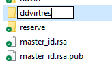
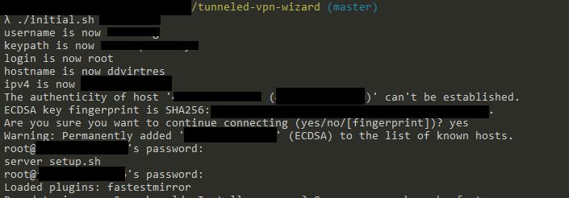
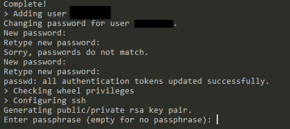
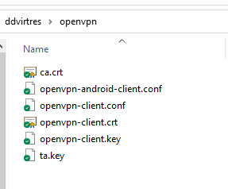
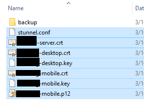
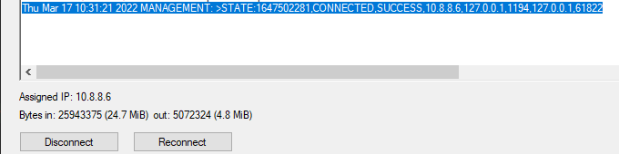

# OpenVPN+Stunnel server configurator
Pull requests are welcome

# How to use?
Script only works on CentOS machines right now!!
1) Create an .ini file with server parameters, including
* `username`: new user to be created
* `keypath`: path on client machine to find `master_id.rsa` and to store newely created id's
* `login`: server login (usually root right away)
* `hostname`: used to create directories and store certificates in `keypath`
* `ipv4`: ipv4 address of the server
* `use_password`: empty parameter to show that there is no `master_id.rsa`
* `port`: for all those who don't want their ssh to be cool, set to `22`

2) Run script with $1 = .ini file
Script expects master_id.rsa to be in `$keypath` directory (!!)

3) MAGIC!

(You can run ssh_only.sh to just reconfigure SSH to be `cool` and download new keys)


# WARNING
The script will
1) Disallow password authentication
2) Change ssh port to `31337` because I'm cool
3) Update yum
4) Install openvpn and stunnel
5) Create certificates for them and keys for ssh
6) Configure openvpn+stunnel+ssh
7) Download certificates and keys
8) Configure IPTables

Do not use on servers you're not ready to loose. Script's tested on new DigitalOcean droplets.


# Additional
If you still want to use the weird $keypath things, you can connect to your servers using this script:
```source $KEYS/$1/$1.ini
if [ -z "$port"  ]
then
    echo "Setting port to default";
    port=31337;
fi;
ssh -p $port -i $KEYS/$hostname/"$username"_id.rsa $username@$ipv4
```

# Easy Tutorial With Pictures
## Download this repo
On the top of this page there is a menu called "Code". Click it and download as an archive.

You can use git clone if you're familiar with it

## Get yourself bash if you're on windows
Options: 
* https://cmder.net/
* https://docs.microsoft.com/en-us/windows/wsl/install
* https://git-scm.com/download/win
* https://www.cygwin.com/

## Create folders
Create a folder you want to use for the script. If you don't want extra folders you can just place `.` 
as a "keypath" later, but full paths are better.

## Create the ini
Think up a funny name for your server (Don't use things like `vpn` to not get confused later) 
and create a file `(name).ini`.
I used `ddvirtres`.


Then you need to create an `.ini` file with the following structure:
```ini
username=your_username
keypath=/path/to/your/folder
login=root
hostname=ddvirtres
ipv4=1.2.3.4
ipv6=
use_password=
port=22
```

* username: is the username which will be created on the server
* keypath: is that folder you have created (or not) in the previous step
  
  **Important**: keypath should work with your bash. Try it by using `cd what\you\entered` and checking if it works.
* login: the current way to access your server, which is usually `root`
* hostname: the funny name you thought up for your server
* ipv4: IP address for your server
* ipv6: ignore
* use_password: just add the empty line if you can't use keys properly right now. 
  The script will require you to enter this password A LOT, so copy it.
* port: leave it as 22 if you need this tutorial. 

### Optional: don't use password.
If you don't want to use a password you must figure out how to add an ssh key to your server. 
Creating an ssh-key is easy: just run `ssh-keygen` in your new bash in Windows and then tell your 
VPS provider via their interface that your key is whatever was created in the `filename.pub`.

**Important** rename your file to `master_id.rsa` and store it in the directory you have set to `keypath`.

# Run the script
To run the script, use `./initial.sh {hostname}`. In my case it will be `./initial.sh ddvirtres`.

First thing that will happen is you will be asked to add the server as trusted. Type out `yes`.


As you can see, your server password is requested a lot. There is no way to store it and it is unsafe anyway. 
If you're new to bash, don't worry that nothing is appearing as you type (or paste) - this is to protect the password.

**Important**: It's hard to copy-paste in bash for windows. Find a way you can paste stuff first, before running.
Usual methods include
* Simple CTRL+V
* Oldschool SHIFT+Ins
* Esoteric Right Mouse Button click.

# New prompts
After a while of inputting your server password, you will be asked to generate new ones.


First, it says `Changing password for (your user)`. This will be your server password to prove that it's you. 
It's not wise to forget it, but it's not a very big deal, tbh.

Next, it asks you for a `passphrase`. This adds another layer of protection for the encryption. 

You can leave this blank if you're not ready to face some more password enterings.

# While it runs
You need two pieces of software to get this to work.
* https://www.stunnel.org/downloads.html -- stunnel
* https://openvpn.net/community-downloads/ -- openvpn

Download them. If you want to also add your android to the mix, you have the following:
* https://play.google.com/store/apps/details?id=link.infra.sslsocks&hl=en&gl=US -- stunnel equivalent (SSLSocks)
* https://play.google.com/store/apps/details?id=de.blinkt.openvpn&hl=en&gl=US -- openvpn. 
  **Important** do not confuse this with `OpenVPN Connect`. Those are different.

# All went well
If there are no problems, there will be two new folders in your `keypath`.

## OpenVPN


First one is the openvpn folder. You also will have the `*.ovpn` file.
Within the GUI of the OpenVPN you can click `Import` and choose this file.

After that, you should copy everything (except openvpn-android-client) from your folder to whatever folder OVPN used to store your configuration. 
Usually it is something along the lines of `C:\Users\(user)\OpenVPN\config\openvpn-client`.

**note**: `.conf` and `.ovpn` files are absolutely identical. If you need one or the other, just change the file extension.

## stunnel


This folder also contains a lot of configs. You're interested in `stunnel.conf` and `(username)-desktop.crt` 
but there's no harm in just copying everything into `/your/stunnel/dir/stunnel/config/`.

# Running it
1) Open stunnel.
If configuration is okay, you shall see the coveted `configuration succesfull`
   


If something went wrong and you're feeling adventerous, you can change your `stunnel.conf` 
and click `Edit->Reload Configuration` until you see the magic line.

2) Open openvpn
Openvpn GUI will show you a log inside a very nice box. When it finishes it's thing, you will see this
   


**Congratulations!**. You are now connected to everything through an HTTPS tunnel, 
making not only your browsing habits unknown to your ISP, but also impossible to know that you're using a VPN connection.

Enjoy.

You can raise an issue if something goes wrong - truth be told, this script is a bit horrible.