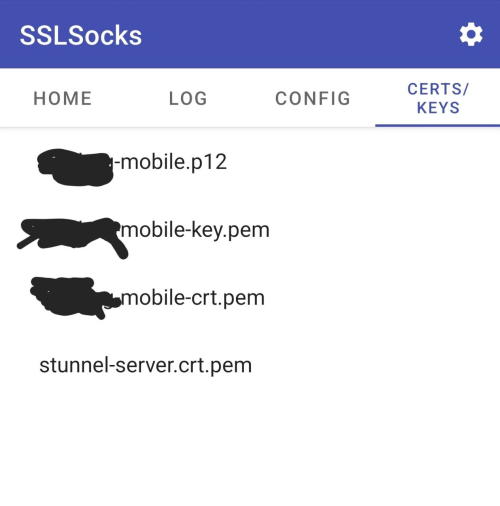

# OpenVPN+Stunnel server configurator
Pull requests are welcome

# ToDo
The solution is poorly coded, buggy and not very user-friendly.

Time is a limited resource, however any issues created with this repo will be addressed.

# How to use?
Download one of the releases into a Windows machine and open the `.exe` file.

# WARNING
The script will
1) Disallow password authentication
2) Mess with iptables
3) Install openvpn and stunnel
4) Create certificates for them and keys for ssh
5) Configure openvpn+stunnel+ssh
6) Download certificates and keys

Do not use on servers you're not ready to lose. Script's tested on new DigitalOcean droplets.

# Easy Tutorial With Pictures
## Download the release
Open the software (best results if ran as Administrator).
Administrator is needed just for one last command which copies config files.

## Install Provided Software
Install `stunnel` and `OpenVPN` distros provided within `install` folder.
If you want to also add your android to the mix, you have the following:
* https://play.google.com/store/apps/details?id=link.infra.sslsocks&hl=en&gl=US -- stunnel equivalent (SSLSocks)
* https://play.google.com/store/apps/details?id=de.blinkt.openvpn&hl=en&gl=US -- openvpn. 
  **Important** do not confuse this with `OpenVPN Connect`. Those are different.

## Get yourself a server.
Services like `digitalocean` or `rudvs` provide a `VPS`. Get one (you don't need more
than 1 CPU and 2 GB memory) and note it's `IP Address`, `username`, and `password`
for access.
If you are an advanced user or a platform requires a use of a key file - add it to your machine as a file.

## Run the executable `vpnwizard.exe`
After you run it, you will be presented with a connection window with the following things to fill in:
1) `IP Address`: This is the address of your server
2) `Port`: This is a port to connect to. Default is 22; Should stay 22.
3) `Username`: Username which has admin access to the server
4) `Password`: Password of the user
5) `Use key file`: If you have a key file, press this button to select a file needed.

## Press Connect
If everything is okay, you will be met with a window full of buttons.

If all works well, just press them one by one from top to bottom and wait for the green flash
to signify an okay result.

* `Perform Base Config` button updates the OS.
* The `switch\create user` button can be used multiple times to change which user connects to the server. Press it if:
  * Your current user is root (do not use root user for this)
  * You want a different one just because (don't forget the password)
* `Configure SSHD` protects the server a bit and forces usage of a keyfile (which is created and downloaded)
* `Configure iptables` protects the server a bit more, refusing unneeded connection attempts
* `Install Software` installs the necessary things **on the server**
* `Configure Software` overrides everything and sets up a new set of files **every run**. If you are already using this solution, pressing this again will cancel your current access.
* `Finalize Home Config` copies necessary files on your machine to the installed folders. 
  * Can fail if not ran as Administrator
  * Can fail if you haven't installed the software in question.

**Give some time**. Some buttons wait a while for the server to download something or run a command.
 Especially the first one.

*Note* that if the last one is red, all you have to do is just move the configuration files to appropriate places
for `stunnel` manually. You probably did not run this as an Administrator.

## Test that everything is fine.
`C:\Program Files (x86)\stunnel\config` should have files in it. If it does not, you can find them within the program folder in `output\dist\stunnel`

`C:\Users\(youruser)\OpenVPN\config` should have files in it. If it does not, you can find them within the program folder in `output\dist\openvpn`

## Running it
1) Open stunnel.
If configuration is okay, you shall see the coveted `configuration succesfull`
   

If something went wrong and you're feeling adventerous, you can change your `stunnel.conf` 
and click `Edit->Reload Configuration` until you see the magic line.

2) Open `openvpn`

Openvpn GUI will show you a log inside a very nice box. When it finishes it's thing, you will see this
   

**Congratulations!**. You are now connected to everything through an HTTPS tunnel, 
making not only your browsing habits unknown to your ISP, but also impossible to know that you're using a VPN connection.

Enjoy.

You can raise an issue if something goes wrong - truth be told, this script is a bit horrible.

## Optional: Mobile
If you have downloaded the things for your android device, you need to get 
the files to your phone.

* `OpenVPN` configuration file is `openvpn-client-android` in the `output\dist` folder.
  * It is the only file needed, everything else is included in it.
* Stunnel configuration requires `(your-username)-mobile` files (`crt`, `key` and `p12`)
as well as `stunnel.conf` and `stunnel-server.crt`.
  * Make sure you know where exactly on your device are those located.

This is how `SSLSocks` look like after every file have been added, though:

